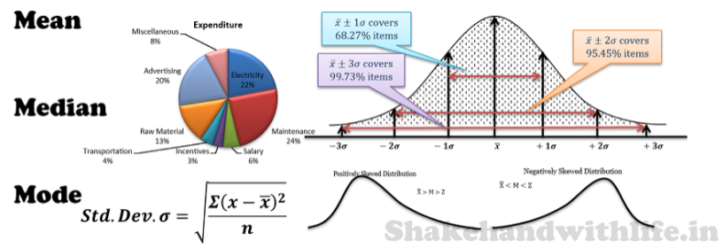

<br>
<br>

:::::: {.columns}

::: {.column width="68%" data-latex="{0.48\textwidth}"}

###  <span style="color:maroon">**About the Data Analytics Working Group**</spa>

The Data Analytics Working Group at [California State University San Bernardino](https://www.csusb.edu/) aims to be a hub for data analytics information and resources for the campus and the community. Its goal is to develop, share, and distribute data analytics skills. The vision is to foster a data-empowered community working within a culture of open science, leveraging expertise across a variety of disciplines including Business, Statistics, and Computer Science.

<br>

#### <span style="color:maroon">**Meet to Analyze Data!**</spa>

Do you have data and questions on where to start with your data analysis? Do you have programming questions? Just want to network, socialize and dedicate time to working on that project with a due date approaching? Join this group during working hours and engage with your faculty and peers in a welcoming, inclusive and supportive environment. 

This is not only fun and rewarding, it keeps the community going and, more broadly, it helps to resolve the scarcity of expertise in data analytics.

Participation is open to everyone. Students, staff, and faculty are invited to join our Data Analytics Working Group sessions. Bring your computer, projects, and questions to this open working environment. 

---
#### <span style="color:maroon">**Working Hours Schedule**</spa>

The following schedule contains room locations for in person hours, and Zoom links to join the virtual open working hours sessions.


```{r, echo = FALSE, warning = FALSE, message=FALSE}
library(googledrive)
library(googlesheets4)
drive_auth()
```


```{r, echo = FALSE, warning = FALSE, message=FALSE}
library(readr)
```


```{r, echo = FALSE, warning = FALSE, message=FALSE}
library(googlesheets4)
gs4_auth()
```


```{r, echo = FALSE, warning = FALSE, message=FALSE}
ss = gs4_get("https://docs.google.com/spreadsheets/d/1tsHRTw91LC7KU7_g-s7Ukg8IUgfTKbO63GxM-H1XSZc/edit#gid=0")

#read data from google
data = read_sheet("https://docs.google.com/spreadsheets/d/1tsHRTw91LC7KU7_g-s7Ukg8IUgfTKbO63GxM-H1XSZc/edit#gid=0")

library(excelR)
```

```{r, echo = FALSE, warning = FALSE, message=FALSE}
df = data
excelTable(df, minDimensions = c(ncol(df),nrow(df)+0)) 

```

<br>

#### <span style="color:maroon">**Zoom Working Hours Sessions**</span>

Click the Names to Connect to the Zoom Working Hours Sessions.
 

```{r, echo = FALSE, warning = FALSE, message=FALSE}
ss = gs4_get("https://docs.google.com/spreadsheets/d/1tUTSE5v816APeq9nhgRpsF27BKK5bkz5hxKd3bUWJwA/edit#gid=0")

#read data from google
data = read_sheet("https://docs.google.com/spreadsheets/d/1tUTSE5v816APeq9nhgRpsF27BKK5bkz5hxKd3bUWJwA/edit#gid=0")

```

```{r, echo = FALSE, warning = FALSE, message=FALSE}
df = data
excelTable(df, minDimensions = c(ncol(df),nrow(df)+0)) 

```

<br>
<br>


:::
::: {.column width="5%" data-latex="{0.04\textwidth}"}
\ 
:::
:::::: {.column width="27%" data-latex="{0.48\textwidth}"}


Contact: [Dr. Essia Hamouda](ehamouda@csusb.edu)
<br>
Assistant Professor, [Information and Decision Sciences](https://www.csusb.edu/ids).

<br>
{width=45%}  {width=45%}
<br><br>
{width=90%}
<br>
<br>
{width=90%}
<br><br>
{width=90%}
<br><br>
{width=90%}
{width=90%}

:::
::::::
